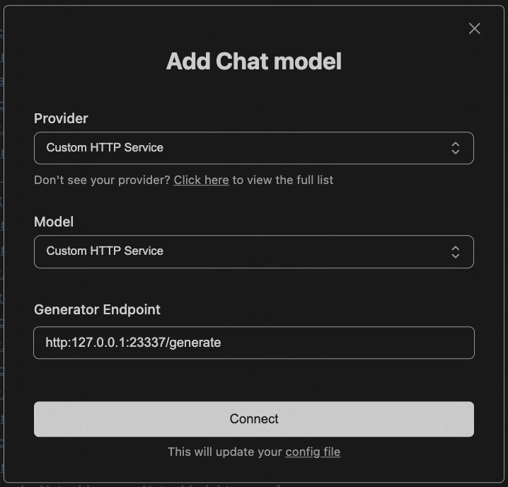

Continue for Lean Copilot
==========================================================

Continue for Lean Copilot aims to integrate Lean Copilot's functionalities (suggest_tactics, search_proof, select_premises) with Continue. Make the Lean Copilot user experience more friendly and seamless. 


# Lean Copilot HTTP Service
This project first requires you to run a server for providing Lean Copilot http service. 
## Steps
1. Clone Lean Copilot at https://github.com/lean-dojo/LeanCopilot.

2. Go to python folder at https://github.com/lean-dojo/LeanCopilot/tree/main/python and follow the readme file (https://github.com/lean-dojo/LeanCopilot/blob/main/python/README.md) to finish the stepup steps of requirements and then run the server.
3. Finally, you will get an address for your http service, like http://127.0.0.1:23337


# Continue Extension for VS Code
With the running lean copilot service, you can then use Continue to interact with Lean Copilot.
## Requirements
* Download and install VS Code.
* Install NVM at https://github.com/nvm-sh/nvm?tab=readme-ov-file.
## Steps
1. Run the below script in this project to install necessary dependencies:
```bash
bash scripts/install-dependencies.sh
```
2. Open this project with VS Code, and then click the following file:
  ```bash
  extensions/vscode/src/extension.ts
  ```

3. Use F5 in keyborad to debug the project.
4. In left bar of Continue, Select Add Chat model and enter the address of your Lean Copilot HTTP Service, like http://127.0.0.1:23337/generate. Note that here you need to add /generate after your address to get the generation service.

5. Finally, you can enjoy the user friendly proof automation, e.g., suggesting tactics/premises and searching for proofs in Continue. 